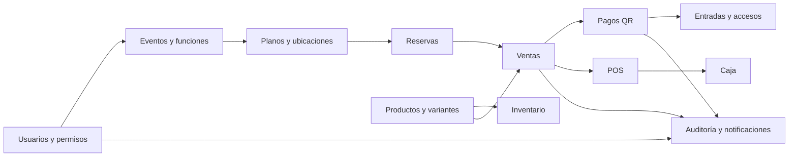
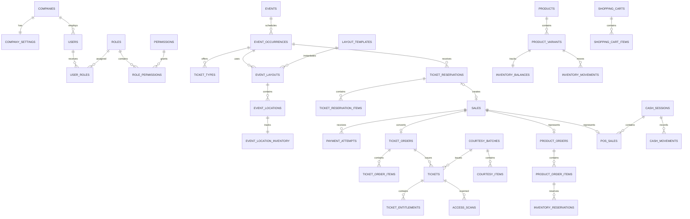

# Estructura de base de datos — Plataforma completa

**Proyecto:** Plataforma de tickets, e-commerce, inventario, POS, caja y dashboard  
**Motor recomendado:** PostgreSQL 16 o superior  
**Backend previsto:** Laravel  
**Modelo:** Relacional, transaccional y preparado para una sola empresa  
**Versión del diseño:** 1.0

---

## 1. Objetivo del diseño

Esta base de datos cubre:

- Administración de eventos y funciones.
- Plantillas de planos cargadas mediante archivos JSON.
- Sectores, mesas, sillas, butacas y áreas de capacidad general.
- Selección temporal y reserva pendiente de pago.
- Prevención de dobles reservas y sobreventa.
- Venta web, venta rápida por boletero y entradas de cortesía.
- Pagos QR mediante una API bancaria.
- Confirmaciones automáticas, consultas manuales e idempotencia.
- Pagos confirmados fuera de tiempo e incidencias de devolución manual.
- Entradas digitales con uno o varios cupos por QR.
- Control de acceso y registro de cada escaneo.
- Catálogo de productos simples y con variantes.
- Carrito, pedidos web e inventario centralizado.
- Ventas POS mediante QR.
- Apertura, movimientos y cierre de una sola caja.
- Roles, permisos, auditoría, correos y dashboard.

El diseño evita mezclar responsabilidades críticas. Los módulos comparten usuarios, clientes, ventas y pagos, pero mantienen sus propias tablas operativas.

---

## 2. Decisiones de arquitectura

### 2.1 Identificadores

- Claves primarias: `uuid`, generadas como UUIDv7 desde la aplicación.
- Números visibles al usuario: cadenas independientes, por ejemplo:
  - `EVT-2026-000001`
  - `TR-2026-000001`
  - `PED-2026-000001`
  - `POS-2026-000001`
- Nunca se debe mostrar el UUID como número de operación.

### 2.2 Fechas

Todos los campos de fecha y hora deben usar:

```text
timestamp with time zone
```

La aplicación mostrará las fechas usando la zona horaria configurada para la empresa.

### 2.3 Dinero

Todos los importes deben usar:

```text
numeric(14,2)
```

No se deben usar `float`, `double` ni tipos binarios para dinero.

### 2.4 Estados

Se recomienda usar `varchar` con restricciones `CHECK`, en lugar de ENUM nativo de PostgreSQL. Esto facilita futuras modificaciones desde migraciones de Laravel.

### 2.5 Eliminación de registros

- Maestros configurables: usar `deleted_at` cuando se necesite eliminación lógica.
- Operaciones financieras, movimientos de inventario, accesos, pagos y auditorías: no eliminar.
- Una operación anulada debe conservarse y cambiar de estado.
- Las entradas, ventas o pagos no deben desaparecer físicamente.

### 2.6 Datos históricos

Las operaciones deben guardar copias de los datos que podrían cambiar:

- Nombre del evento.
- Fecha y hora de la función.
- Nombre del tipo de entrada.
- Código y nombre de la ubicación.
- Nombre y SKU del producto.
- Precio de venta.
- Costo del producto.
- Datos del comprador.
- Descuento aplicado.

Esto evita que editar un evento, producto o precio altere ventas anteriores.

---

## 3. Mapa general de módulos



---

# 4. Núcleo de empresa, configuración y seguridad

## 4.1 `companies`

Aunque la primera versión tendrá una sola empresa, se conserva una entidad raíz para centralizar propiedad, identidad y configuración.

| Campo | Tipo | Nulo | Regla |
|---|---|---:|---|
| `id` | uuid | No | PK |
| `legal_name` | varchar(180) | No | Razón social |
| `commercial_name` | varchar(180) | No | Nombre visible |
| `tax_identifier` | varchar(50) | Sí | NIT u otro identificador |
| `contact_email` | varchar(180) | Sí | |
| `contact_phone` | varchar(40) | Sí | |
| `logo_media_id` | uuid | Sí | FK `media_assets.id` |
| `status` | varchar(20) | No | `active`, `inactive` |
| `created_at` | timestamptz | No | |
| `updated_at` | timestamptz | No | |

---

## 4.2 `company_settings`

Una fila por empresa.

| Campo | Tipo | Nulo | Regla |
|---|---|---:|---|
| `company_id` | uuid | No | PK y FK `companies.id` |
| `currency_code` | char(3) | No | Inicialmente `BOB` |
| `timezone` | varchar(80) | No | Ej. `America/La_Paz` |
| `temporary_selection_minutes` | smallint | No | Inicialmente `5` |
| `payment_reservation_minutes` | smallint | No | Inicialmente `20` |
| `sender_name` | varchar(150) | Sí | |
| `sender_email` | varchar(180) | Sí | |
| `support_email` | varchar(180) | Sí | |
| `support_phone` | varchar(40) | Sí | |
| `primary_color` | varchar(20) | Sí | |
| `secondary_color` | varchar(20) | Sí | |
| `settings_json` | jsonb | No | Configuraciones menores |
| `updated_by_user_id` | uuid | Sí | FK `users.id` |
| `created_at` | timestamptz | No | |
| `updated_at` | timestamptz | No | |

Restricciones:

```text
temporary_selection_minutes > 0
payment_reservation_minutes > 0
```

---

## 4.3 `users`

Contiene cuentas autenticadas de personal interno y compradores registrados.

| Campo | Tipo | Nulo | Regla |
|---|---|---:|---|
| `id` | uuid | No | PK |
| `company_id` | uuid | Sí | FK; nulo para comprador sin relación laboral |
| `name` | varchar(180) | No | |
| `email` | varchar(180) | No | Único, normalizado |
| `phone` | varchar(40) | Sí | |
| `password` | varchar(255) | No | Hash |
| `user_type` | varchar(20) | No | `staff`, `customer` |
| `status` | varchar(20) | No | `active`, `blocked`, `inactive` |
| `email_verified_at` | timestamptz | Sí | |
| `last_login_at` | timestamptz | Sí | |
| `remember_token` | varchar(100) | Sí | |
| `created_at` | timestamptz | No | |
| `updated_at` | timestamptz | No | |
| `deleted_at` | timestamptz | Sí | Eliminación lógica |

Índices:

```text
UNIQUE lower(email)
INDEX (company_id, status)
```

---

## 4.4 `customers`

Representa al comprador, tenga o no una cuenta. Permite asociar distintas compras realizadas como invitado.

| Campo | Tipo | Nulo | Regla |
|---|---|---:|---|
| `id` | uuid | No | PK |
| `user_id` | uuid | Sí | FK único `users.id` |
| `full_name` | varchar(180) | No | |
| `email` | varchar(180) | Sí | |
| `phone` | varchar(40) | Sí | |
| `identity_document` | varchar(80) | Sí | Cifrado recomendado |
| `notes` | text | Sí | Uso interno |
| `status` | varchar(20) | No | `active`, `blocked`, `anonymized` |
| `created_at` | timestamptz | No | |
| `updated_at` | timestamptz | No | |
| `deleted_at` | timestamptz | Sí | |

Notas:

- La compra web puede exigir nombre, teléfono, correo y carnet desde validaciones de aplicación.
- La venta rápida de boletería puede admitir datos parciales.
- Las ventas conservarán una copia de los datos del comprador aunque este perfil se modifique.

---

## 4.5 `roles`

| Campo | Tipo | Nulo | Regla |
|---|---|---:|---|
| `id` | uuid | No | PK |
| `company_id` | uuid | No | FK |
| `name` | varchar(100) | No | |
| `code` | varchar(100) | No | Ej. `ticket_admin` |
| `module` | varchar(30) | No | `tickets`, `pos`, `global` |
| `is_system` | boolean | No | Impide eliminar roles base |
| `created_at` | timestamptz | No | |
| `updated_at` | timestamptz | No | |

Restricción:

```text
UNIQUE (company_id, code)
```

Roles iniciales sugeridos:

- `global_admin`
- `ticket_admin`
- `ticket_seller`
- `ticket_scanner`
- `pos_admin`
- `pos_seller`

---

## 4.6 `permissions`

| Campo | Tipo | Nulo | Regla |
|---|---|---:|---|
| `id` | uuid | No | PK |
| `code` | varchar(140) | No | Único |
| `module` | varchar(30) | No | |
| `description` | varchar(255) | No | |

Ejemplos:

```text
events.create
events.update
tickets.issue
tickets.issue_courtesy
tickets.void
access.scan
products.manage
inventory.adjust
pos.sell
cash.open
cash.close
dashboard.view
payments.review_incidents
```

---

## 4.7 `role_permissions`

| Campo | Tipo | Nulo | Regla |
|---|---|---:|---|
| `role_id` | uuid | No | FK |
| `permission_id` | uuid | No | FK |

PK compuesta:

```text
(role_id, permission_id)
```

---

## 4.8 `user_roles`

| Campo | Tipo | Nulo | Regla |
|---|---|---:|---|
| `user_id` | uuid | No | FK |
| `role_id` | uuid | No | FK |
| `assigned_by_user_id` | uuid | Sí | FK |
| `assigned_at` | timestamptz | No | |

PK compuesta:

```text
(user_id, role_id)
```

---

## 4.9 `event_staff_assignments`

Permite limitar a un escaneador o boletero a determinados eventos o funciones.

| Campo | Tipo | Nulo | Regla |
|---|---|---:|---|
| `id` | uuid | No | PK |
| `event_occurrence_id` | uuid | No | FK |
| `user_id` | uuid | No | FK |
| `assignment_type` | varchar(30) | No | `scanner`, `ticket_seller`, `supervisor` |
| `active_from` | timestamptz | Sí | |
| `active_until` | timestamptz | Sí | |
| `assigned_by_user_id` | uuid | No | FK |
| `created_at` | timestamptz | No | |

Restricción:

```text
UNIQUE (event_occurrence_id, user_id, assignment_type)
```

---

## 4.10 `media_assets`

Registro central de archivos e imágenes.

| Campo | Tipo | Nulo | Regla |
|---|---|---:|---|
| `id` | uuid | No | PK |
| `company_id` | uuid | No | FK |
| `disk` | varchar(50) | No | Ej. `s3`, `public` |
| `path` | varchar(500) | No | |
| `original_name` | varchar(255) | No | |
| `mime_type` | varchar(120) | No | |
| `size_bytes` | bigint | No | |
| `checksum_sha256` | char(64) | Sí | |
| `width` | integer | Sí | Para imágenes |
| `height` | integer | Sí | Para imágenes |
| `uploaded_by_user_id` | uuid | Sí | FK |
| `created_at` | timestamptz | No | |
| `deleted_at` | timestamptz | Sí | |

---

## 4.11 `legal_documents`

Versiona términos, condiciones y política de privacidad.

| Campo | Tipo | Nulo | Regla |
|---|---|---:|---|
| `id` | uuid | No | PK |
| `company_id` | uuid | No | FK |
| `document_type` | varchar(30) | No | `terms`, `privacy` |
| `version` | varchar(30) | No | |
| `content` | text | No | |
| `published_at` | timestamptz | Sí | |
| `is_active` | boolean | No | |
| `created_by_user_id` | uuid | No | FK |
| `created_at` | timestamptz | No | |

Restricción:

```text
UNIQUE (company_id, document_type, version)
```

---

## 4.12 `legal_acceptances`

| Campo | Tipo | Nulo | Regla |
|---|---|---:|---|
| `id` | uuid | No | PK |
| `legal_document_id` | uuid | No | FK |
| `customer_id` | uuid | Sí | FK |
| `user_id` | uuid | Sí | FK |
| `sale_id` | uuid | Sí | FK |
| `accepted_at` | timestamptz | No | |
| `ip_address` | inet | Sí | |
| `user_agent` | text | Sí | |

---

# 5. Eventos y catálogo público

## 5.1 `event_categories`

| Campo | Tipo | Nulo | Regla |
|---|---|---:|---|
| `id` | uuid | No | PK |
| `company_id` | uuid | No | FK |
| `name` | varchar(120) | No | |
| `slug` | varchar(140) | No | |
| `sort_order` | integer | No | |
| `is_active` | boolean | No | |
| `created_at` | timestamptz | No | |
| `updated_at` | timestamptz | No | |
| `deleted_at` | timestamptz | Sí | |

Restricción:

```text
UNIQUE (company_id, slug)
```

---

## 5.2 `events`

Representa el evento comercial. Las fechas concretas se almacenan en `event_occurrences`.

| Campo | Tipo | Nulo | Regla |
|---|---|---:|---|
| `id` | uuid | No | PK |
| `company_id` | uuid | No | FK |
| `event_category_id` | uuid | Sí | FK |
| `public_code` | varchar(40) | No | Único |
| `name` | varchar(220) | No | |
| `slug` | varchar(240) | No | |
| `short_description` | varchar(500) | Sí | |
| `description` | text | Sí | |
| `venue_name` | varchar(220) | No | |
| `venue_address` | varchar(300) | Sí | |
| `city` | varchar(120) | Sí | |
| `latitude` | numeric(10,7) | Sí | |
| `longitude` | numeric(10,7) | Sí | |
| `status` | varchar(20) | No | `draft`, `published`, `finished`, `cancelled` |
| `published_at` | timestamptz | Sí | |
| `cancelled_at` | timestamptz | Sí | |
| `created_by_user_id` | uuid | No | FK |
| `updated_by_user_id` | uuid | Sí | FK |
| `created_at` | timestamptz | No | |
| `updated_at` | timestamptz | No | |
| `deleted_at` | timestamptz | Sí | |

Índices:

```text
UNIQUE (company_id, public_code)
UNIQUE (company_id, slug)
INDEX (company_id, status, published_at)
INDEX (event_category_id, status)
```

---

## 5.3 `event_occurrences`

Permite que un evento tenga una o varias funciones, fechas u horarios.

| Campo | Tipo | Nulo | Regla |
|---|---|---:|---|
| `id` | uuid | No | PK |
| `event_id` | uuid | No | FK |
| `name` | varchar(180) | Sí | Ej. “Función noche” |
| `starts_at` | timestamptz | No | |
| `ends_at` | timestamptz | Sí | |
| `doors_open_at` | timestamptz | Sí | |
| `sales_start_at` | timestamptz | Sí | |
| `sales_end_at` | timestamptz | Sí | |
| `status` | varchar(20) | No | `draft`, `published`, `finished`, `cancelled` |
| `capacity_snapshot` | integer | Sí | Capacidad publicada |
| `created_at` | timestamptz | No | |
| `updated_at` | timestamptz | No | |
| `deleted_at` | timestamptz | Sí | |

Restricciones:

```text
ends_at IS NULL OR ends_at > starts_at
sales_end_at IS NULL OR sales_start_at IS NULL OR sales_end_at > sales_start_at
```

Índice principal:

```text
INDEX (status, starts_at)
```

---

## 5.4 `event_media`

| Campo | Tipo | Nulo | Regla |
|---|---|---:|---|
| `event_id` | uuid | No | FK |
| `media_asset_id` | uuid | No | FK |
| `media_role` | varchar(30) | No | `cover`, `gallery`, `mobile_cover` |
| `sort_order` | integer | No | |

PK compuesta:

```text
(event_id, media_asset_id)
```

---

# 6. Plantillas de planos y ubicaciones

## 6.1 `layout_templates`

Almacena cada archivo de plano cargado desde administración.

| Campo | Tipo | Nulo | Regla |
|---|---|---:|---|
| `id` | uuid | No | PK |
| `company_id` | uuid | No | FK |
| `name` | varchar(180) | No | |
| `version` | integer | No | |
| `schema_version` | varchar(30) | No | Versión del formato JSON |
| `source_media_id` | uuid | No | FK al archivo cargado |
| `source_json` | jsonb | No | Contenido validado |
| `checksum_sha256` | char(64) | No | |
| `status` | varchar(20) | No | `active`, `inactive`, `replaced` |
| `validation_status` | varchar(20) | No | `pending`, `valid`, `invalid` |
| `validation_errors` | jsonb | Sí | |
| `created_by_user_id` | uuid | No | FK |
| `created_at` | timestamptz | No | |
| `updated_at` | timestamptz | No | |
| `deleted_at` | timestamptz | Sí | |

Restricción:

```text
UNIQUE (company_id, name, version)
```

---

## 6.2 `layout_template_nodes`

Representación normalizada de los elementos del archivo.

| Campo | Tipo | Nulo | Regla |
|---|---|---:|---|
| `id` | uuid | No | PK |
| `layout_template_id` | uuid | No | FK |
| `parent_id` | uuid | Sí | FK a la misma tabla |
| `external_key` | varchar(140) | No | ID único dentro del JSON |
| `node_type` | varchar(30) | No | `sector`, `table`, `chair`, `seat`, `general_area`, `decoration` |
| `label` | varchar(150) | Sí | |
| `capacity` | integer | No | `1` para ubicación individual |
| `is_selectable` | boolean | No | |
| `sale_mode` | varchar(20) | No | `individual`, `capacity`, `container` |
| `geometry_json` | jsonb | No | Posición, tamaño, forma, rotación |
| `style_json` | jsonb | No | |
| `metadata_json` | jsonb | No | |
| `sort_order` | integer | No | |
| `created_at` | timestamptz | No | |

Restricciones:

```text
UNIQUE (layout_template_id, external_key)
capacity >= 0
```

---

## 6.3 `event_layouts`

Asocia una plantilla con una función específica. Guarda una copia para impedir que cambios futuros en la plantilla alteren ubicaciones ya vendidas.

| Campo | Tipo | Nulo | Regla |
|---|---|---:|---|
| `id` | uuid | No | PK |
| `event_occurrence_id` | uuid | No | FK |
| `layout_template_id` | uuid | No | FK |
| `template_version` | integer | No | |
| `snapshot_json` | jsonb | No | Copia inmutable usada para generar el mapa |
| `status` | varchar(20) | No | `draft`, `active`, `inactive` |
| `activated_at` | timestamptz | Sí | |
| `created_by_user_id` | uuid | No | FK |
| `created_at` | timestamptz | No | |
| `updated_at` | timestamptz | No | |

Índice único parcial recomendado:

```sql
CREATE UNIQUE INDEX uq_active_layout_per_occurrence
ON event_layouts (event_occurrence_id)
WHERE status = 'active';
```

---

## 6.4 `event_locations`

Copia operativa de los elementos de plano para una función. Las reservas nunca se realizan directamente sobre la plantilla.

| Campo | Tipo | Nulo | Regla |
|---|---|---:|---|
| `id` | uuid | No | PK |
| `event_layout_id` | uuid | No | FK |
| `template_node_id` | uuid | Sí | FK |
| `parent_id` | uuid | Sí | FK a `event_locations.id` |
| `external_key` | varchar(140) | No | |
| `location_type` | varchar(30) | No | Igual que `node_type` |
| `label` | varchar(150) | Sí | |
| `capacity_total` | integer | No | |
| `is_selectable` | boolean | No | |
| `is_visible` | boolean | No | |
| `is_enabled` | boolean | No | |
| `sale_mode` | varchar(20) | No | `individual`, `capacity`, `container` |
| `geometry_json` | jsonb | No | Copia del plano |
| `style_json` | jsonb | No | |
| `metadata_json` | jsonb | No | |
| `created_at` | timestamptz | No | |
| `updated_at` | timestamptz | No | |

Restricciones:

```text
UNIQUE (event_layout_id, external_key)
capacity_total >= 0
```

Una ubicación individual tendrá normalmente:

```text
capacity_total = 1
sale_mode = individual
```

Un sector general tendrá:

```text
capacity_total > 1
sale_mode = capacity
```

---

# 7. Tipos de entrada, precios y disponibilidad

## 7.1 `ticket_types`

| Campo | Tipo | Nulo | Regla |
|---|---|---:|---|
| `id` | uuid | No | PK |
| `event_occurrence_id` | uuid | No | FK |
| `name` | varchar(160) | No | |
| `description` | text | Sí | |
| `code` | varchar(80) | No | |
| `base_price` | numeric(14,2) | No | |
| `quota_total` | integer | Sí | Nulo cuando depende solo del plano |
| `minimum_per_order` | integer | No | Inicialmente `1` |
| `maximum_per_order` | integer | Sí | |
| `sales_start_at` | timestamptz | Sí | |
| `sales_end_at` | timestamptz | Sí | |
| `is_active` | boolean | No | |
| `sort_order` | integer | No | |
| `created_at` | timestamptz | No | |
| `updated_at` | timestamptz | No | |
| `deleted_at` | timestamptz | Sí | |

Restricciones:

```text
UNIQUE (event_occurrence_id, code)
base_price >= 0
quota_total IS NULL OR quota_total >= 0
```

---

## 7.2 `event_location_ticket_types`

Define qué tipo de entrada puede comprar una ubicación y si posee un precio particular.

| Campo | Tipo | Nulo | Regla |
|---|---|---:|---|
| `id` | uuid | No | PK |
| `event_location_id` | uuid | No | FK |
| `ticket_type_id` | uuid | No | FK |
| `price_override` | numeric(14,2) | Sí | |
| `is_active` | boolean | No | |
| `created_at` | timestamptz | No | |

Restricción:

```text
UNIQUE (event_location_id, ticket_type_id)
price_override IS NULL OR price_override >= 0
```

---

## 7.3 `event_location_inventory`

Estado operativo de cada ubicación seleccionable. Esta tabla es el punto de bloqueo transaccional para evitar dobles reservas.

| Campo | Tipo | Nulo | Regla |
|---|---|---:|---|
| `event_location_id` | uuid | No | PK y FK |
| `capacity_total` | integer | No | Copia de la capacidad |
| `blocked_quantity` | integer | No | Producción/invitados |
| `selection_quantity` | integer | No | Selección de 5 minutos |
| `payment_reserved_quantity` | integer | No | Reserva de 20 minutos |
| `sold_quantity` | integer | No | Compras pagadas |
| `courtesy_quantity` | integer | No | Cortesías emitidas |
| `available_quantity` | integer | No | Columna generada |
| `lock_version` | bigint | No | Control optimista opcional |
| `updated_at` | timestamptz | No | |

Fórmula:

```sql
available_quantity =
    capacity_total
    - blocked_quantity
    - selection_quantity
    - payment_reserved_quantity
    - sold_quantity
    - courtesy_quantity
```

Restricciones:

```text
Todos los contadores >= 0
available_quantity >= 0
```

---

## 7.4 `ticket_type_inventory`

Controla el cupo global de un tipo de entrada cuando se haya definido `quota_total`.

| Campo | Tipo | Nulo | Regla |
|---|---|---:|---|
| `ticket_type_id` | uuid | No | PK y FK |
| `quota_total` | integer | Sí | |
| `selection_quantity` | integer | No | |
| `payment_reserved_quantity` | integer | No | |
| `sold_quantity` | integer | No | |
| `courtesy_quantity` | integer | No | |
| `available_quantity` | integer | Sí | Generado si hay cuota |
| `lock_version` | bigint | No | |
| `updated_at` | timestamptz | No | |

---

## 7.5 `event_location_blocks`

Bloqueos administrativos para producción, invitados o cupos destinados a cortesía.

| Campo | Tipo | Nulo | Regla |
|---|---|---:|---|
| `id` | uuid | No | PK |
| `event_location_id` | uuid | No | FK |
| `quantity` | integer | No | |
| `block_type` | varchar(30) | No | `production`, `guest`, `courtesy_hold`, `other` |
| `reason` | text | Sí | |
| `status` | varchar(20) | No | `active`, `released` |
| `blocked_by_user_id` | uuid | No | FK |
| `released_by_user_id` | uuid | Sí | FK |
| `blocked_at` | timestamptz | No | |
| `released_at` | timestamptz | Sí | |

---

## 7.6 `event_inventory_movements`

Libro inmutable de movimientos de disponibilidad.

| Campo | Tipo | Nulo | Regla |
|---|---|---:|---|
| `id` | uuid | No | PK |
| `event_location_id` | uuid | No | FK |
| `ticket_type_id` | uuid | Sí | FK |
| `movement_type` | varchar(40) | No | |
| `quantity` | integer | No | Positiva |
| `from_bucket` | varchar(30) | Sí | |
| `to_bucket` | varchar(30) | Sí | |
| `reservation_item_id` | uuid | Sí | FK |
| `ticket_order_item_id` | uuid | Sí | FK |
| `courtesy_item_id` | uuid | Sí | FK |
| `location_block_id` | uuid | Sí | FK |
| `performed_by_user_id` | uuid | Sí | FK |
| `metadata_json` | jsonb | No | |
| `created_at` | timestamptz | No | |

Ejemplos de movimientos:

```text
available -> selection
selection -> available
selection -> payment_reserved
payment_reserved -> sold
payment_reserved -> available
available -> courtesy
available -> blocked
blocked -> available
```

---

# 8. Promociones

## 8.1 `promotion_codes`

| Campo | Tipo | Nulo | Regla |
|---|---|---:|---|
| `id` | uuid | No | PK |
| `event_id` | uuid | No | FK |
| `code` | varchar(80) | No | Normalizado a mayúsculas |
| `discount_type` | varchar(20) | No | `percentage`, `fixed` |
| `discount_value` | numeric(14,2) | No | |
| `minimum_amount` | numeric(14,2) | Sí | |
| `maximum_discount` | numeric(14,2) | Sí | |
| `maximum_redemptions` | integer | Sí | |
| `maximum_per_customer` | integer | Sí | |
| `starts_at` | timestamptz | Sí | |
| `ends_at` | timestamptz | Sí | |
| `is_active` | boolean | No | |
| `created_by_user_id` | uuid | No | FK |
| `created_at` | timestamptz | No | |
| `updated_at` | timestamptz | No | |

Restricción:

```text
UNIQUE (event_id, code)
discount_value > 0
```

---

## 8.2 `promotion_ticket_types`

| Campo | Tipo | Nulo | Regla |
|---|---|---:|---|
| `promotion_code_id` | uuid | No | FK |
| `ticket_type_id` | uuid | No | FK |

PK compuesta:

```text
(promotion_code_id, ticket_type_id)
```

Si una promoción no tiene registros en esta tabla, se considera aplicable a todos los tipos de entrada del evento.

---

## 8.3 `promotion_redemptions`

| Campo | Tipo | Nulo | Regla |
|---|---|---:|---|
| `id` | uuid | No | PK |
| `promotion_code_id` | uuid | No | FK |
| `sale_id` | uuid | No | FK |
| `customer_id` | uuid | Sí | FK |
| `discount_amount` | numeric(14,2) | No | |
| `status` | varchar(20) | No | `reserved`, `consumed`, `released` |
| `created_at` | timestamptz | No | |
| `consumed_at` | timestamptz | Sí | |

---

# 9. Venta común y numeración

## 9.1 `number_sequences`

Genera números visibles sin depender del UUID.

| Campo | Tipo | Nulo | Regla |
|---|---|---:|---|
| `company_id` | uuid | No | FK |
| `sequence_type` | varchar(30) | No | `ticket_order`, `product_order`, `pos_sale`, `sale` |
| `year` | smallint | No | |
| `current_value` | bigint | No | |
| `updated_at` | timestamptz | No | |

PK compuesta:

```text
(company_id, sequence_type, year)
```

Debe incrementarse usando bloqueo `FOR UPDATE`.

---

## 9.2 `sales`

Entidad financiera común para tickets, productos y POS.

| Campo | Tipo | Nulo | Regla |
|---|---|---:|---|
| `id` | uuid | No | PK |
| `company_id` | uuid | No | FK |
| `public_number` | varchar(50) | No | Único |
| `sale_type` | varchar(20) | No | `ticket`, `product`, `pos` |
| `channel` | varchar(30) | No | `web`, `ticket_office`, `pos`, `admin` |
| `customer_id` | uuid | Sí | FK |
| `created_by_user_id` | uuid | Sí | Boletero, vendedor o administrador |
| `currency_code` | char(3) | No | |
| `subtotal_amount` | numeric(14,2) | No | |
| `discount_amount` | numeric(14,2) | No | |
| `total_amount` | numeric(14,2) | No | |
| `status` | varchar(30) | No | `draft`, `pending_payment`, `paid`, `expired`, `cancelled` |
| `paid_at` | timestamptz | Sí | |
| `expired_at` | timestamptz | Sí | |
| `cancelled_at` | timestamptz | Sí | |
| `metadata_json` | jsonb | No | |
| `created_at` | timestamptz | No | |
| `updated_at` | timestamptz | No | |

Restricciones:

```text
UNIQUE (company_id, public_number)
subtotal_amount >= 0
discount_amount >= 0
total_amount >= 0
total_amount = subtotal_amount - discount_amount
```

Índices:

```text
INDEX (company_id, sale_type, status, created_at)
INDEX (customer_id, created_at)
```

---

## 9.3 `sale_discounts`

Copia inmutable de cada descuento aplicado.

| Campo | Tipo | Nulo | Regla |
|---|---|---:|---|
| `id` | uuid | No | PK |
| `sale_id` | uuid | No | FK |
| `promotion_code_id` | uuid | Sí | FK |
| `description` | varchar(220) | No | |
| `discount_type_snapshot` | varchar(20) | No | |
| `discount_value_snapshot` | numeric(14,2) | No | |
| `discount_amount` | numeric(14,2) | No | |
| `created_at` | timestamptz | No | |

---

# 10. Reservas de entradas

## 10.1 `ticket_reservations`

Una reserva atraviesa dos tiempos distintos: selección temporal y espera de pago.

| Campo | Tipo | Nulo | Regla |
|---|---|---:|---|
| `id` | uuid | No | PK |
| `event_occurrence_id` | uuid | No | FK |
| `sale_id` | uuid | Sí | FK único; se crea al confirmar la selección |
| `customer_id` | uuid | Sí | FK |
| `session_token_hash` | char(64) | No | Identifica al visitante invitado |
| `status` | varchar(30) | No | `temporary_selection`, `pending_payment`, `paid`, `expired`, `cancelled` |
| `selection_expires_at` | timestamptz | No | |
| `payment_expires_at` | timestamptz | Sí | |
| `confirmed_at` | timestamptz | Sí | |
| `paid_at` | timestamptz | Sí | |
| `expired_at` | timestamptz | Sí | |
| `buyer_name` | varchar(180) | Sí | Snapshot |
| `buyer_email` | varchar(180) | Sí | Snapshot |
| `buyer_phone` | varchar(40) | Sí | Snapshot |
| `buyer_identity_document` | varchar(80) | Sí | Snapshot cifrado |
| `created_by_user_id` | uuid | Sí | Nulo en autocompra |
| `created_at` | timestamptz | No | |
| `updated_at` | timestamptz | No | |

Índices esenciales:

```text
INDEX (status, selection_expires_at)
INDEX (status, payment_expires_at)
INDEX (event_occurrence_id, status)
UNIQUE (sale_id) WHERE sale_id IS NOT NULL
```

---

## 10.2 `ticket_reservation_items`

| Campo | Tipo | Nulo | Regla |
|---|---|---:|---|
| `id` | uuid | No | PK |
| `ticket_reservation_id` | uuid | No | FK |
| `ticket_type_id` | uuid | No | FK |
| `event_location_id` | uuid | No | FK |
| `quantity` | integer | No | |
| `unit_price_snapshot` | numeric(14,2) | No | |
| `line_subtotal` | numeric(14,2) | No | |
| `status` | varchar(20) | No | `held`, `released`, `converted` |
| `created_at` | timestamptz | No | |
| `updated_at` | timestamptz | No | |

Restricciones:

```text
quantity > 0
line_subtotal = quantity * unit_price_snapshot
UNIQUE (ticket_reservation_id, event_location_id, ticket_type_id)
```

---

## 10.3 `ticket_reservation_events`

Historial específico del ciclo de reserva.

| Campo | Tipo | Nulo | Regla |
|---|---|---:|---|
| `id` | uuid | No | PK |
| `ticket_reservation_id` | uuid | No | FK |
| `event_type` | varchar(40) | No | |
| `previous_status` | varchar(30) | Sí | |
| `new_status` | varchar(30) | Sí | |
| `performed_by_user_id` | uuid | Sí | FK |
| `payment_attempt_id` | uuid | Sí | FK |
| `metadata_json` | jsonb | No | |
| `created_at` | timestamptz | No | |

Tipos sugeridos:

```text
selection_created
selection_extended
selection_confirmed
selection_expired
payment_started
payment_confirmed
payment_expired
late_payment_received
reservation_cancelled
converted_to_order
```

---

# 11. Pagos QR e incidencias

## 11.1 `payment_attempts`

Una venta puede tener más de un intento de pago, pero solo uno puede liquidarla.

| Campo | Tipo | Nulo | Regla |
|---|---|---:|---|
| `id` | uuid | No | PK |
| `sale_id` | uuid | No | FK |
| `provider_code` | varchar(50) | No | Banco configurado en código |
| `provider_reference` | varchar(180) | Sí | Referencia enviada al banco |
| `provider_transaction_id` | varchar(180) | Sí | Identificador devuelto |
| `idempotency_key` | varchar(180) | No | Único |
| `amount` | numeric(14,2) | No | |
| `currency_code` | char(3) | No | |
| `status` | varchar(30) | No | `pending`, `paid`, `expired`, `failed`, `cancelled` |
| `qr_payload_encrypted` | text | Sí | No guardar en texto abierto |
| `qr_expires_at` | timestamptz | Sí | |
| `requested_at` | timestamptz | No | |
| `confirmed_at` | timestamptz | Sí | |
| `last_checked_at` | timestamptz | Sí | Botón “Ya realicé el pago” |
| `failure_code` | varchar(100) | Sí | |
| `failure_message` | text | Sí | |
| `created_at` | timestamptz | No | |
| `updated_at` | timestamptz | No | |

Restricciones e índices:

```text
UNIQUE (idempotency_key)
UNIQUE (provider_code, provider_transaction_id)
INDEX (sale_id, status)
INDEX (status, qr_expires_at)
amount > 0
```

El segundo índice único debe permitir valores nulos.

---

## 11.2 `payment_events`

Guarda callbacks, webhooks y consultas manuales. Es la base de la idempotencia bancaria.

| Campo | Tipo | Nulo | Regla |
|---|---|---:|---|
| `id` | uuid | No | PK |
| `payment_attempt_id` | uuid | Sí | FK |
| `provider_code` | varchar(50) | No | |
| `provider_event_id` | varchar(180) | Sí | |
| `event_source` | varchar(30) | No | `webhook`, `status_query`, `manual_query`, `internal` |
| `event_type` | varchar(80) | No | |
| `signature_valid` | boolean | Sí | |
| `raw_payload` | jsonb | No | Redactar datos sensibles |
| `received_at` | timestamptz | No | |
| `processed_at` | timestamptz | Sí | |
| `processing_status` | varchar(20) | No | `pending`, `processed`, `ignored`, `failed` |
| `processing_message` | text | Sí | |

Restricción recomendada:

```text
UNIQUE (provider_code, provider_event_id)
```

---

## 11.3 `payment_incidents`

Casos que requieren revisión humana.

| Campo | Tipo | Nulo | Regla |
|---|---|---:|---|
| `id` | uuid | No | PK |
| `sale_id` | uuid | No | FK |
| `payment_attempt_id` | uuid | No | FK |
| `ticket_reservation_id` | uuid | Sí | FK |
| `incident_type` | varchar(40) | No | |
| `status` | varchar(30) | No | `open`, `under_review`, `resolved`, `rejected` |
| `expected_amount` | numeric(14,2) | Sí | |
| `received_amount` | numeric(14,2) | Sí | |
| `description` | text | No | |
| `assigned_to_user_id` | uuid | Sí | FK |
| `opened_at` | timestamptz | No | |
| `resolved_at` | timestamptz | Sí | |
| `resolution_notes` | text | Sí | |

Tipos sugeridos:

```text
late_confirmation
amount_mismatch
duplicate_confirmation
unknown_reference
expired_sale_paid
manual_review
```

---

## 11.4 `payment_incident_actions`

| Campo | Tipo | Nulo | Regla |
|---|---|---:|---|
| `id` | uuid | No | PK |
| `payment_incident_id` | uuid | No | FK |
| `action_type` | varchar(40) | No | |
| `notes` | text | Sí | |
| `performed_by_user_id` | uuid | No | FK |
| `metadata_json` | jsonb | No | |
| `created_at` | timestamptz | No | |

---

## 11.5 `manual_refunds`

La primera versión no ejecuta reembolsos automáticos. Esta tabla controla la devolución manual.

| Campo | Tipo | Nulo | Regla |
|---|---|---:|---|
| `id` | uuid | No | PK |
| `payment_incident_id` | uuid | No | FK |
| `payment_attempt_id` | uuid | No | FK |
| `amount` | numeric(14,2) | No | |
| `status` | varchar(30) | No | `pending`, `approved`, `completed`, `rejected` |
| `reason` | text | No | |
| `approved_by_user_id` | uuid | Sí | FK |
| `completed_by_user_id` | uuid | Sí | FK |
| `external_reference` | varchar(180) | Sí | Comprobante o referencia bancaria |
| `proof_media_id` | uuid | Sí | FK |
| `requested_at` | timestamptz | No | |
| `completed_at` | timestamptz | Sí | |
| `notes` | text | Sí | |

---

# 12. Órdenes y entradas digitales

## 12.1 `ticket_orders`

Solo se crea automáticamente cuando el pago válido se confirma dentro del flujo permitido.

| Campo | Tipo | Nulo | Regla |
|---|---|---:|---|
| `id` | uuid | No | PK |
| `sale_id` | uuid | No | FK único |
| `ticket_reservation_id` | uuid | No | FK único |
| `event_occurrence_id` | uuid | No | FK |
| `order_number` | varchar(50) | No | Único |
| `buyer_name` | varchar(180) | Sí | Snapshot |
| `buyer_email` | varchar(180) | Sí | Snapshot |
| `buyer_phone` | varchar(40) | Sí | Snapshot |
| `buyer_identity_document` | varchar(80) | Sí | Snapshot cifrado |
| `event_name_snapshot` | varchar(220) | No | |
| `occurrence_starts_at_snapshot` | timestamptz | No | |
| `status` | varchar(20) | No | `paid`, `cancelled` |
| `created_at` | timestamptz | No | |
| `cancelled_at` | timestamptz | Sí | |
| `cancelled_by_user_id` | uuid | Sí | FK |
| `cancellation_reason` | text | Sí | |

---

## 12.2 `ticket_order_items`

| Campo | Tipo | Nulo | Regla |
|---|---|---:|---|
| `id` | uuid | No | PK |
| `ticket_order_id` | uuid | No | FK |
| `ticket_type_id` | uuid | No | FK |
| `event_location_id` | uuid | No | FK |
| `ticket_type_name_snapshot` | varchar(160) | No | |
| `location_label_snapshot` | varchar(160) | Sí | |
| `location_external_key_snapshot` | varchar(140) | No | |
| `quantity` | integer | No | |
| `unit_price` | numeric(14,2) | No | |
| `discount_amount` | numeric(14,2) | No | |
| `line_total` | numeric(14,2) | No | |
| `created_at` | timestamptz | No | |

---

## 12.3 `courtesy_batches`

Una emisión de cortesías puede contener una o varias ubicaciones.

| Campo | Tipo | Nulo | Regla |
|---|---|---:|---|
| `id` | uuid | No | PK |
| `event_occurrence_id` | uuid | No | FK |
| `public_number` | varchar(50) | No | Único |
| `recipient_name` | varchar(180) | Sí | |
| `recipient_email` | varchar(180) | Sí | |
| `recipient_phone` | varchar(40) | Sí | |
| `reason` | text | Sí | |
| `status` | varchar(20) | No | `issued`, `cancelled` |
| `issued_by_user_id` | uuid | No | FK |
| `issued_at` | timestamptz | No | |
| `cancelled_by_user_id` | uuid | Sí | FK |
| `cancelled_at` | timestamptz | Sí | |

No existe relación con `sales`.

---

## 12.4 `courtesy_items`

| Campo | Tipo | Nulo | Regla |
|---|---|---:|---|
| `id` | uuid | No | PK |
| `courtesy_batch_id` | uuid | No | FK |
| `ticket_type_id` | uuid | No | FK |
| `event_location_id` | uuid | No | FK |
| `quantity` | integer | No | |
| `ticket_type_name_snapshot` | varchar(160) | No | |
| `location_label_snapshot` | varchar(160) | Sí | |
| `created_at` | timestamptz | No | |

---

## 12.5 `tickets`

Cada registro representa una credencial QR. Una credencial puede habilitar uno o varios cupos.

| Campo | Tipo | Nulo | Regla |
|---|---|---:|---|
| `id` | uuid | No | PK |
| `event_occurrence_id` | uuid | No | FK |
| `ticket_order_id` | uuid | Sí | FK |
| `courtesy_batch_id` | uuid | Sí | FK |
| `public_code` | varchar(70) | No | Visible |
| `qr_token_hash` | char(64) | No | Único; nunca guardar token abierto |
| `status` | varchar(20) | No | `active`, `exhausted`, `voided` |
| `quota_total` | integer | No | |
| `quota_used` | integer | No | |
| `recipient_name` | varchar(180) | Sí | |
| `recipient_email` | varchar(180) | Sí | |
| `issued_at` | timestamptz | No | |
| `voided_at` | timestamptz | Sí | |
| `voided_by_user_id` | uuid | Sí | FK |
| `void_reason` | text | Sí | |
| `last_sent_at` | timestamptz | Sí | |
| `created_at` | timestamptz | No | |
| `updated_at` | timestamptz | No | |

Restricciones:

```text
UNIQUE (public_code)
UNIQUE (qr_token_hash)
quota_total > 0
quota_used >= 0
quota_used <= quota_total
```

Debe cumplirse exactamente uno:

```text
ticket_order_id IS NOT NULL
courtesy_batch_id IS NOT NULL
```

---

## 12.6 `ticket_entitlements`

Detalla qué ubicaciones y cupos contiene cada QR.

| Campo | Tipo | Nulo | Regla |
|---|---|---:|---|
| `id` | uuid | No | PK |
| `ticket_id` | uuid | No | FK |
| `ticket_order_item_id` | uuid | Sí | FK |
| `courtesy_item_id` | uuid | Sí | FK |
| `ticket_type_id` | uuid | No | FK |
| `event_location_id` | uuid | No | FK |
| `quantity` | integer | No | |
| `created_at` | timestamptz | No | |

Debe existir exactamente una fuente:

```text
ticket_order_item_id o courtesy_item_id
```

La suma de `quantity` debe coincidir con `tickets.quota_total`.

---

## 12.7 `ticket_status_history`

| Campo | Tipo | Nulo | Regla |
|---|---|---:|---|
| `id` | uuid | No | PK |
| `ticket_id` | uuid | No | FK |
| `previous_status` | varchar(20) | Sí | |
| `new_status` | varchar(20) | No | |
| `reason` | text | Sí | |
| `performed_by_user_id` | uuid | Sí | FK |
| `created_at` | timestamptz | No | |

---

# 13. Control de acceso

## 13.1 `access_scans`

Registra tanto escaneos válidos como intentos rechazados.

| Campo | Tipo | Nulo | Regla |
|---|---|---:|---|
| `id` | uuid | No | PK |
| `event_occurrence_id` | uuid | No | Evento seleccionado por el escaneador |
| `ticket_id` | uuid | Sí | Nulo si el código no existe |
| `scanner_user_id` | uuid | No | FK |
| `qr_fingerprint` | char(64) | Sí | Hash para investigar códigos inválidos |
| `scan_result` | varchar(40) | No | |
| `consumed_quantity` | integer | No | `0` o `1` inicialmente |
| `quota_before` | integer | Sí | |
| `quota_after` | integer | Sí | |
| `device_identifier` | varchar(180) | Sí | |
| `ip_address` | inet | Sí | |
| `notes` | text | Sí | |
| `scanned_at` | timestamptz | No | |

Resultados sugeridos:

```text
valid_consumed
valid_no_consumption
exhausted
voided
wrong_event
invalid_code
not_assigned
system_error
```

Índices:

```text
INDEX (event_occurrence_id, scanned_at)
INDEX (ticket_id, scanned_at)
INDEX (scanner_user_id, scanned_at)
```

El incremento de `quota_used` y la inserción de `access_scans` deben ejecutarse en una sola transacción.

---

# 14. Catálogo de productos

## 14.1 `product_categories`

| Campo | Tipo | Nulo | Regla |
|---|---|---:|---|
| `id` | uuid | No | PK |
| `company_id` | uuid | No | FK |
| `parent_id` | uuid | Sí | FK a la misma tabla |
| `name` | varchar(160) | No | |
| `slug` | varchar(180) | No | |
| `description` | text | Sí | |
| `sort_order` | integer | No | |
| `is_visible` | boolean | No | |
| `is_active` | boolean | No | |
| `created_at` | timestamptz | No | |
| `updated_at` | timestamptz | No | |
| `deleted_at` | timestamptz | Sí | |

Restricción:

```text
UNIQUE (company_id, slug)
```

---

## 14.2 `products`

El producto contiene información comercial. Todo elemento vendible tendrá al menos una fila en `product_variants`.

| Campo | Tipo | Nulo | Regla |
|---|---|---:|---|
| `id` | uuid | No | PK |
| `company_id` | uuid | No | FK |
| `name` | varchar(220) | No | |
| `slug` | varchar(240) | No | |
| `description` | text | Sí | |
| `product_type` | varchar(20) | No | `simple`, `variant` |
| `status` | varchar(20) | No | `draft`, `published`, `hidden`, `inactive` |
| `is_featured` | boolean | No | |
| `hide_when_out_of_stock` | boolean | No | |
| `published_at` | timestamptz | Sí | |
| `created_by_user_id` | uuid | No | FK |
| `updated_by_user_id` | uuid | Sí | FK |
| `created_at` | timestamptz | No | |
| `updated_at` | timestamptz | No | |
| `deleted_at` | timestamptz | Sí | |

Restricción:

```text
UNIQUE (company_id, slug)
```

---

## 14.3 `product_category_links`

Permite que un producto aparezca en más de una categoría.

| Campo | Tipo | Nulo | Regla |
|---|---|---:|---|
| `product_id` | uuid | No | FK |
| `product_category_id` | uuid | No | FK |
| `is_primary` | boolean | No | |

PK compuesta:

```text
(product_id, product_category_id)
```

---

## 14.4 `product_variants`

Incluso un producto simple tendrá una variante predeterminada. De esta forma, precios, códigos e inventario siempre se administran igual.

| Campo | Tipo | Nulo | Regla |
|---|---|---:|---|
| `id` | uuid | No | PK |
| `product_id` | uuid | No | FK |
| `name` | varchar(180) | Sí | Nulo o “Predeterminada” para simple |
| `sku` | varchar(100) | No | Código interno |
| `barcode` | varchar(120) | Sí | |
| `sale_price` | numeric(14,2) | No | |
| `purchase_cost` | numeric(14,2) | No | |
| `low_stock_threshold` | integer | No | |
| `attributes_json` | jsonb | No | Ej. talla, color |
| `is_default` | boolean | No | |
| `is_active` | boolean | No | |
| `sort_order` | integer | No | |
| `created_at` | timestamptz | No | |
| `updated_at` | timestamptz | No | |
| `deleted_at` | timestamptz | Sí | |

Restricciones:

```text
UNIQUE (sku)
UNIQUE (barcode) WHERE barcode IS NOT NULL
sale_price >= 0
purchase_cost >= 0
low_stock_threshold >= 0
```

Para un producto simple:

```text
exactamente una variante activa
is_default = true
```

---

## 14.5 `product_media`

| Campo | Tipo | Nulo | Regla |
|---|---|---:|---|
| `id` | uuid | No | PK |
| `product_id` | uuid | No | FK |
| `product_variant_id` | uuid | Sí | Imagen específica de variante |
| `media_asset_id` | uuid | No | FK |
| `media_role` | varchar(20) | No | `cover`, `gallery` |
| `sort_order` | integer | No | |
| `created_at` | timestamptz | No | |

---

# 15. Carrito y pedidos web

## 15.1 `shopping_carts`

| Campo | Tipo | Nulo | Regla |
|---|---|---:|---|
| `id` | uuid | No | PK |
| `customer_id` | uuid | Sí | FK |
| `user_id` | uuid | Sí | FK |
| `session_token_hash` | char(64) | Sí | Invitados |
| `status` | varchar(20) | No | `active`, `converted`, `abandoned`, `expired` |
| `currency_code` | char(3) | No | |
| `expires_at` | timestamptz | Sí | |
| `created_at` | timestamptz | No | |
| `updated_at` | timestamptz | No | |

Debe existir al menos uno:

```text
customer_id, user_id o session_token_hash
```

---

## 15.2 `shopping_cart_items`

| Campo | Tipo | Nulo | Regla |
|---|---|---:|---|
| `id` | uuid | No | PK |
| `shopping_cart_id` | uuid | No | FK |
| `product_variant_id` | uuid | No | FK |
| `quantity` | integer | No | |
| `unit_price_snapshot` | numeric(14,2) | No | Referencial hasta checkout |
| `created_at` | timestamptz | No | |
| `updated_at` | timestamptz | No | |

Restricción:

```text
UNIQUE (shopping_cart_id, product_variant_id)
quantity > 0
```

El stock se reserva al crear el pedido pendiente, no al agregar al carrito.

---

## 15.3 `product_orders`

| Campo | Tipo | Nulo | Regla |
|---|---|---:|---|
| `id` | uuid | No | PK |
| `sale_id` | uuid | No | FK único |
| `shopping_cart_id` | uuid | Sí | FK |
| `order_number` | varchar(50) | No | Único |
| `customer_id` | uuid | Sí | FK |
| `buyer_name` | varchar(180) | No | Snapshot |
| `buyer_email` | varchar(180) | Sí | Snapshot |
| `buyer_phone` | varchar(40) | Sí | Snapshot |
| `buyer_identity_document` | varchar(80) | Sí | Snapshot cifrado |
| `status` | varchar(30) | No | `pending_payment`, `paid`, `delivered`, `cancelled` |
| `payment_expires_at` | timestamptz | Sí | |
| `paid_at` | timestamptz | Sí | |
| `delivered_at` | timestamptz | Sí | |
| `delivered_by_user_id` | uuid | Sí | FK |
| `cancelled_at` | timestamptz | Sí | |
| `cancelled_by_user_id` | uuid | Sí | FK |
| `cancellation_reason` | text | Sí | |
| `fulfillment_notes` | text | Sí | Coordinación externa |
| `created_at` | timestamptz | No | |
| `updated_at` | timestamptz | No | |

Índices:

```text
UNIQUE (order_number)
INDEX (status, created_at)
INDEX (buyer_email)
INDEX (buyer_phone)
```

---

## 15.4 `product_order_items`

Guarda precio y costo histórico para calcular utilidad real.

| Campo | Tipo | Nulo | Regla |
|---|---|---:|---|
| `id` | uuid | No | PK |
| `product_order_id` | uuid | No | FK |
| `product_variant_id` | uuid | No | FK |
| `product_name_snapshot` | varchar(220) | No | |
| `variant_name_snapshot` | varchar(180) | Sí | |
| `sku_snapshot` | varchar(100) | No | |
| `quantity` | integer | No | |
| `unit_price` | numeric(14,2) | No | |
| `unit_cost` | numeric(14,2) | No | |
| `line_subtotal` | numeric(14,2) | No | |
| `discount_amount` | numeric(14,2) | No | |
| `line_total` | numeric(14,2) | No | |
| `cost_total` | numeric(14,2) | No | |
| `profit_amount` | numeric(14,2) | No | |
| `created_at` | timestamptz | No | |

Fórmulas:

```text
cost_total = unit_cost * quantity
profit_amount = line_total - cost_total
```

---

# 16. Inventario centralizado

## 16.1 `inventory_balances`

Una fila por variante. La primera versión no utiliza almacenes ni sucursales.

| Campo | Tipo | Nulo | Regla |
|---|---|---:|---|
| `product_variant_id` | uuid | No | PK y FK |
| `on_hand_quantity` | integer | No | Existencia física |
| `reserved_quantity` | integer | No | Pedidos pendientes |
| `available_quantity` | integer | No | Generado |
| `lock_version` | bigint | No | |
| `updated_at` | timestamptz | No | |

Fórmula:

```text
available_quantity = on_hand_quantity - reserved_quantity
```

Restricciones:

```text
on_hand_quantity >= 0
reserved_quantity >= 0
available_quantity >= 0
```

---

## 16.2 `inventory_reservations`

| Campo | Tipo | Nulo | Regla |
|---|---|---:|---|
| `id` | uuid | No | PK |
| `product_order_item_id` | uuid | No | FK |
| `product_variant_id` | uuid | No | FK |
| `quantity` | integer | No | |
| `status` | varchar(20) | No | `active`, `consumed`, `released`, `expired` |
| `expires_at` | timestamptz | No | |
| `consumed_at` | timestamptz | Sí | |
| `released_at` | timestamptz | Sí | |
| `created_at` | timestamptz | No | |

Índice:

```text
INDEX (status, expires_at)
```

---

## 16.3 `inventory_adjustments`

Cabecera de entradas, salidas y correcciones manuales.

| Campo | Tipo | Nulo | Regla |
|---|---|---:|---|
| `id` | uuid | No | PK |
| `adjustment_number` | varchar(50) | No | Único |
| `adjustment_type` | varchar(30) | No | `entry`, `exit`, `count`, `correction` |
| `reason` | text | No | |
| `status` | varchar(20) | No | `draft`, `confirmed`, `cancelled` |
| `created_by_user_id` | uuid | No | FK |
| `confirmed_by_user_id` | uuid | Sí | FK |
| `created_at` | timestamptz | No | |
| `confirmed_at` | timestamptz | Sí | |

---

## 16.4 `inventory_adjustment_items`

| Campo | Tipo | Nulo | Regla |
|---|---|---:|---|
| `id` | uuid | No | PK |
| `inventory_adjustment_id` | uuid | No | FK |
| `product_variant_id` | uuid | No | FK |
| `quantity_delta` | integer | No | Positivo o negativo |
| `unit_cost` | numeric(14,2) | Sí | |
| `notes` | text | Sí | |

---

## 16.5 `inventory_movements`

Libro inmutable de inventario.

| Campo | Tipo | Nulo | Regla |
|---|---|---:|---|
| `id` | uuid | No | PK |
| `product_variant_id` | uuid | No | FK |
| `movement_type` | varchar(40) | No | |
| `on_hand_delta` | integer | No | |
| `reserved_delta` | integer | No | |
| `on_hand_before` | integer | No | |
| `on_hand_after` | integer | No | |
| `reserved_before` | integer | No | |
| `reserved_after` | integer | No | |
| `product_order_item_id` | uuid | Sí | FK |
| `pos_sale_item_id` | uuid | Sí | FK |
| `inventory_reservation_id` | uuid | Sí | FK |
| `inventory_adjustment_item_id` | uuid | Sí | FK |
| `performed_by_user_id` | uuid | Sí | FK |
| `reason` | text | Sí | |
| `created_at` | timestamptz | No | |

Tipos sugeridos:

```text
manual_entry
manual_exit
adjustment
web_order_reserved
web_order_reservation_released
web_order_paid
web_order_cancelled_restock
pos_sale
pos_sale_reversal
```

---

## 16.6 `stock_alerts`

Evita enviar repetidamente la misma alerta de stock bajo.

| Campo | Tipo | Nulo | Regla |
|---|---|---:|---|
| `id` | uuid | No | PK |
| `product_variant_id` | uuid | No | FK |
| `alert_type` | varchar(30) | No | `low_stock`, `out_of_stock` |
| `status` | varchar(20) | No | `open`, `acknowledged`, `resolved` |
| `quantity_at_open` | integer | No | |
| `opened_at` | timestamptz | No | |
| `acknowledged_by_user_id` | uuid | Sí | FK |
| `acknowledged_at` | timestamptz | Sí | |
| `resolved_at` | timestamptz | Sí | |

Índice único parcial:

```sql
CREATE UNIQUE INDEX uq_open_stock_alert
ON stock_alerts (product_variant_id, alert_type)
WHERE status IN ('open', 'acknowledged');
```

---

# 17. Punto de venta

## 17.1 `pos_sales`

| Campo | Tipo | Nulo | Regla |
|---|---|---:|---|
| `id` | uuid | No | PK |
| `sale_id` | uuid | No | FK único |
| `sale_number` | varchar(50) | No | Único |
| `cash_session_id` | uuid | No | FK |
| `seller_user_id` | uuid | No | FK |
| `customer_id` | uuid | Sí | FK |
| `status` | varchar(30) | No | `pending_payment`, `confirmed`, `cancelled` |
| `confirmed_at` | timestamptz | Sí | |
| `cancelled_at` | timestamptz | Sí | |
| `cancelled_by_user_id` | uuid | Sí | FK |
| `cancellation_reason` | text | Sí | |
| `created_at` | timestamptz | No | |
| `updated_at` | timestamptz | No | |

Una venta POS solo puede crearse dentro de una caja abierta.

---

## 17.2 `pos_sale_items`

| Campo | Tipo | Nulo | Regla |
|---|---|---:|---|
| `id` | uuid | No | PK |
| `pos_sale_id` | uuid | No | FK |
| `product_variant_id` | uuid | No | FK |
| `product_name_snapshot` | varchar(220) | No | |
| `variant_name_snapshot` | varchar(180) | Sí | |
| `sku_snapshot` | varchar(100) | No | |
| `quantity` | integer | No | |
| `unit_price` | numeric(14,2) | No | |
| `unit_cost` | numeric(14,2) | No | |
| `line_total` | numeric(14,2) | No | |
| `cost_total` | numeric(14,2) | No | |
| `profit_amount` | numeric(14,2) | No | |
| `created_at` | timestamptz | No | |

El inventario se descuenta únicamente cuando el pago QR se confirma.

---

# 18. Caja

## 18.1 `cash_registers`

Aunque exista una sola caja, se mantiene una entidad explícita.

| Campo | Tipo | Nulo | Regla |
|---|---|---:|---|
| `id` | uuid | No | PK |
| `company_id` | uuid | No | FK |
| `name` | varchar(120) | No | |
| `code` | varchar(50) | No | |
| `is_primary` | boolean | No | |
| `is_active` | boolean | No | |
| `created_at` | timestamptz | No | |
| `updated_at` | timestamptz | No | |

Restricción:

```text
UNIQUE (company_id, code)
```

La primera versión debe crear una sola caja activa.

---

## 18.2 `cash_sessions`

Representa cada apertura y cierre.

| Campo | Tipo | Nulo | Regla |
|---|---|---:|---|
| `id` | uuid | No | PK |
| `cash_register_id` | uuid | No | FK |
| `session_number` | varchar(50) | No | Único |
| `status` | varchar(20) | No | `open`, `closed` |
| `opened_by_user_id` | uuid | No | FK |
| `opened_at` | timestamptz | No | |
| `opening_amount` | numeric(14,2) | No | Puede ser `0` |
| `closed_by_user_id` | uuid | Sí | FK |
| `closed_at` | timestamptz | Sí | |
| `expected_amount` | numeric(14,2) | Sí | |
| `declared_amount` | numeric(14,2) | Sí | |
| `difference_amount` | numeric(14,2) | Sí | |
| `closing_notes` | text | Sí | |
| `created_at` | timestamptz | No | |
| `updated_at` | timestamptz | No | |

Índice único parcial:

```sql
CREATE UNIQUE INDEX uq_single_open_cash_session
ON cash_sessions ((1))
WHERE status = 'open';
```

Este índice garantiza una sola caja abierta en toda la plataforma.

---

## 18.3 `cash_movements`

| Campo | Tipo | Nulo | Regla |
|---|---|---:|---|
| `id` | uuid | No | PK |
| `cash_session_id` | uuid | No | FK |
| `movement_type` | varchar(30) | No | `pos_sale`, `manual_income`, `manual_expense`, `refund`, `adjustment` |
| `direction` | varchar(10) | No | `in`, `out` |
| `amount` | numeric(14,2) | No | |
| `pos_sale_id` | uuid | Sí | FK |
| `payment_attempt_id` | uuid | Sí | FK |
| `description` | text | No | |
| `created_by_user_id` | uuid | No | FK |
| `authorized_by_user_id` | uuid | Sí | FK |
| `created_at` | timestamptz | No | |

Restricciones:

```text
amount > 0
UNIQUE (payment_attempt_id) WHERE payment_attempt_id IS NOT NULL
```

Una caja cerrada no puede recibir movimientos normales.

---

# 19. Correos, eventos internos y auditoría

## 19.1 `outbound_emails`

| Campo | Tipo | Nulo | Regla |
|---|---|---:|---|
| `id` | uuid | No | PK |
| `company_id` | uuid | No | FK |
| `template_code` | varchar(100) | No | |
| `recipient_email` | varchar(180) | No | |
| `recipient_name` | varchar(180) | Sí | |
| `subject` | varchar(255) | No | |
| `related_type` | varchar(60) | Sí | |
| `related_id` | uuid | Sí | |
| `status` | varchar(20) | No | `queued`, `sending`, `sent`, `failed` |
| `provider_message_id` | varchar(180) | Sí | |
| `attempts` | smallint | No | |
| `last_error` | text | Sí | |
| `queued_at` | timestamptz | No | |
| `sent_at` | timestamptz | Sí | |
| `created_at` | timestamptz | No | |
| `updated_at` | timestamptz | No | |

Permite registrar:

- Confirmación de reserva.
- Confirmación de pago.
- Envío y reenvío de entradas.
- Confirmación de pedido.
- Cambio importante de pedido.
- Alerta de stock bajo.
- Verificación y recuperación de cuenta.

---

## 19.2 `outbox_events`

Garantiza que acciones posteriores a una transacción no se pierdan.

| Campo | Tipo | Nulo | Regla |
|---|---|---:|---|
| `id` | uuid | No | PK |
| `aggregate_type` | varchar(60) | No | |
| `aggregate_id` | uuid | No | |
| `event_type` | varchar(100) | No | |
| `payload_json` | jsonb | No | |
| `status` | varchar(20) | No | `pending`, `processing`, `processed`, `failed` |
| `available_at` | timestamptz | No | |
| `processed_at` | timestamptz | Sí | |
| `attempts` | integer | No | |
| `last_error` | text | Sí | |
| `created_at` | timestamptz | No | |

Ejemplos:

```text
payment.confirmed
ticket.order.created
ticket.email.requested
product.order.paid
inventory.low_stock
pos.sale.confirmed
cash.movement.created
reservation.expired
```

Los WebSockets deben publicar eventos derivados de esta tabla o del mismo servicio transaccional.

---

## 19.3 `audit_logs`

Auditoría transversal de acciones administrativas.

| Campo | Tipo | Nulo | Regla |
|---|---|---:|---|
| `id` | uuid | No | PK |
| `company_id` | uuid | Sí | FK |
| `actor_user_id` | uuid | Sí | FK |
| `action` | varchar(140) | No | |
| `entity_type` | varchar(100) | No | |
| `entity_id` | uuid | Sí | |
| `before_json` | jsonb | Sí | |
| `after_json` | jsonb | Sí | |
| `reason` | text | Sí | |
| `ip_address` | inet | Sí | |
| `user_agent` | text | Sí | |
| `request_id` | uuid | Sí | |
| `created_at` | timestamptz | No | |

Acciones que siempre deben auditarse:

- Creación, publicación, cancelación o duplicación de eventos.
- Cambio de precios o capacidades.
- Carga, reemplazo o desactivación de planos.
- Bloqueo o liberación de ubicaciones.
- Emisión y anulación de cortesías.
- Anulación de entradas.
- Revisión de pagos tardíos.
- Registro y conclusión de devoluciones.
- Ajustes de inventario.
- Cancelación de pedidos o ventas.
- Apertura y cierre de caja.
- Ingresos y egresos manuales.
- Cambio de roles y permisos.

---

# 20. Reglas transaccionales críticas

## 20.1 Seleccionar una ubicación

La aplicación no debe consultar disponibilidad y luego actualizar en dos operaciones separadas.

Debe usar una actualización atómica:

```sql
UPDATE event_location_inventory
SET
    selection_quantity = selection_quantity + :quantity,
    lock_version = lock_version + 1,
    updated_at = now()
WHERE event_location_id = :event_location_id
  AND available_quantity >= :quantity;
```

- Si la consulta afecta una fila, la ubicación quedó seleccionada.
- Si afecta cero filas, ya no existe disponibilidad.
- En la misma transacción se inserta `ticket_reservation_items` y `event_inventory_movements`.

Para un asiento individual, `capacity_total = 1`, por lo que esta regla impide dos selecciones simultáneas.

---

## 20.2 Confirmar la reserva

Dentro de una transacción:

1. Bloquear `ticket_reservations`.
2. Verificar que siga en `temporary_selection`.
3. Verificar `selection_expires_at > now()`.
4. Mover cantidades de `selection_quantity` a `payment_reserved_quantity`.
5. Crear `sales`.
6. Asignar `sale_id` a la reserva.
7. Definir `payment_expires_at`.
8. Crear el intento QR.
9. Registrar el evento de reserva.
10. Confirmar la transacción.

---

## 20.3 Vencer una selección

Un proceso programado debe buscar:

```text
status = temporary_selection
selection_expires_at <= now()
```

Debe liberar la cantidad de `selection_quantity`, marcar los ítems como `released` y la reserva como `expired`.

El proceso debe ser idempotente: ejecutar dos veces no puede liberar dos veces.

---

## 20.4 Confirmar un pago de entradas

Dentro de una única transacción:

1. Bloquear `payment_attempts`.
2. Ignorar el evento si ya está procesado.
3. Validar referencia, moneda y monto.
4. Bloquear `ticket_reservations`.
5. Verificar si la reserva sigue dentro del plazo.
6. Si está vigente:
   - marcar pago como `paid`;
   - marcar venta como `paid`;
   - mover inventario de `payment_reserved` a `sold`;
   - crear `ticket_orders`;
   - crear los ítems;
   - crear uno o varios `tickets`;
   - crear `ticket_entitlements`;
   - marcar reserva como `paid`;
   - insertar eventos en `outbox_events`.
7. Confirmar la transacción.

El correo y la publicación WebSocket deben ejecutarse después de confirmar la transacción.

---

## 20.5 Pago confirmado fuera de tiempo

Cuando la reserva ya venció:

1. Marcar el `payment_attempt` como `paid`.
2. No cambiar `sales.status` a `paid`.
3. No volver a reservar ubicaciones.
4. No crear `ticket_orders`.
5. No crear entradas.
6. Crear `payment_incidents` de tipo `late_confirmation`.
7. Registrar `ticket_reservation_events.late_payment_received`.
8. Notificar al personal autorizado.
9. Permitir registrar la devolución en `manual_refunds`.

Esto conserva evidencia del dinero recibido sin provocar una doble venta.

---

## 20.6 Reservar stock de productos

Usar una actualización atómica:

```sql
UPDATE inventory_balances
SET
    reserved_quantity = reserved_quantity + :quantity,
    lock_version = lock_version + 1,
    updated_at = now()
WHERE product_variant_id = :variant_id
  AND available_quantity >= :quantity;
```

En la misma transacción:

- Crear `inventory_reservations`.
- Crear el pedido pendiente.
- Crear el movimiento correspondiente.

---

## 20.7 Confirmar pedido web

Al confirmarse el pago:

1. Bloquear el pedido, las reservas y los saldos.
2. Disminuir `reserved_quantity`.
3. Disminuir `on_hand_quantity`.
4. Marcar reservas como `consumed`.
5. Insertar movimientos.
6. Marcar pedido y venta como pagados.
7. Emitir correo mediante `outbox_events`.

---

## 20.8 Confirmar venta POS

1. Verificar que la caja siga abierta.
2. Confirmar el pago QR.
3. Bloquear saldos de inventario.
4. Descontar existencias.
5. Marcar venta POS como `confirmed`.
6. Crear movimiento de inventario.
7. Crear movimiento de caja.
8. Mantener una restricción única por `payment_attempt_id`.

---

## 20.9 Consumir un cupo de entrada

Actualización atómica recomendada:

```sql
UPDATE tickets
SET
    quota_used = quota_used + 1,
    status = CASE
        WHEN quota_used + 1 = quota_total THEN 'exhausted'
        ELSE 'active'
    END,
    updated_at = now()
WHERE id = :ticket_id
  AND status = 'active'
  AND quota_used < quota_total;
```

En la misma transacción se inserta `access_scans`.

---

# 21. Índices esenciales

## Eventos

```text
events(company_id, status, published_at)
event_occurrences(status, starts_at)
event_occurrences(event_id, starts_at)
event_locations(event_layout_id, external_key)
event_location_ticket_types(ticket_type_id, is_active)
```

## Reservas

```text
ticket_reservations(status, selection_expires_at)
ticket_reservations(status, payment_expires_at)
ticket_reservations(event_occurrence_id, status)
ticket_reservation_items(ticket_reservation_id)
```

## Pagos

```text
payment_attempts(sale_id, status)
payment_attempts(status, qr_expires_at)
payment_events(processing_status, received_at)
payment_incidents(status, opened_at)
```

## Entradas y acceso

```text
tickets(qr_token_hash)
tickets(event_occurrence_id, status)
access_scans(event_occurrence_id, scanned_at)
access_scans(ticket_id, scanned_at)
```

## Productos e inventario

```text
products(company_id, status, is_featured)
product_variants(product_id, is_active)
product_variants(sku)
inventory_reservations(status, expires_at)
inventory_movements(product_variant_id, created_at)
```

## Pedidos y POS

```text
product_orders(status, created_at)
product_orders(buyer_email)
product_orders(buyer_phone)
pos_sales(cash_session_id, status)
pos_sales(seller_user_id, created_at)
cash_movements(cash_session_id, created_at)
```

## Búsqueda pública

Para búsquedas por nombre o descripción se recomienda PostgreSQL Full Text Search o índices `GIN` con `pg_trgm`:

```sql
CREATE EXTENSION IF NOT EXISTS pg_trgm;
```

Aplicar a:

```text
events.name
events.description
products.name
products.description
```

---

# 22. Vistas sugeridas para el dashboard

No se recomienda crear tablas duplicadas de estadísticas en la primera versión. El dashboard puede empezar con vistas SQL.

## 22.1 `vw_event_kpis`

Por evento y función:

- Entradas vendidas.
- Cortesías emitidas.
- Cupos utilizados.
- Cupos disponibles.
- Ingresos pagados.
- Reservas pendientes.
- Pagos tardíos.

## 22.2 `vw_event_location_availability`

Por ubicación:

```text
capacity_total
blocked_quantity
selection_quantity
payment_reserved_quantity
sold_quantity
courtesy_quantity
available_quantity
```

## 22.3 `vw_product_stock`

Por variante:

```text
on_hand_quantity
reserved_quantity
available_quantity
low_stock_threshold
is_low_stock
is_out_of_stock
```

## 22.4 `vw_product_profit`

Por periodo y canal:

```text
product_name
variant_name
quantity_sold
gross_revenue
cost_total
profit_amount
channel
```

Debe incluir pedidos web pagados y ventas POS confirmadas.

## 22.5 `vw_cash_session_summary`

Por sesión:

```text
opening_amount
pos_income
manual_income
manual_expense
refunds
expected_amount
declared_amount
difference_amount
```

## 22.6 `vw_pending_attention`

Debe agrupar:

- Pagos tardíos.
- Incidencias abiertas.
- Pedidos pendientes vencidos.
- Reservas que no pudieron liberarse.
- Correos fallidos.
- Productos con stock bajo.
- Caja abierta por tiempo anormal.

---

# 23. Relaciones principales



---

# 24. Restricciones de integridad recomendadas

## 24.1 Fuente de una entrada

En `tickets` debe existir exactamente una fuente:

```sql
CHECK (
    (ticket_order_id IS NOT NULL)::int
    + (courtesy_batch_id IS NOT NULL)::int
    = 1
);
```

## 24.2 Fuente de un entitlement

```sql
CHECK (
    (ticket_order_item_id IS NOT NULL)::int
    + (courtesy_item_id IS NOT NULL)::int
    = 1
);
```

## 24.3 Totales no negativos

Aplicar `CHECK >= 0` a:

- Importes.
- Cantidades.
- Contadores de inventario.
- Cupos.
- Costos.
- Descuentos.

## 24.4 Coherencia de fechas

- `ends_at > starts_at`.
- `payment_expires_at > confirmed_at`.
- `closed_at >= opened_at`.
- `delivered_at >= paid_at`.
- `resolved_at >= opened_at`.

## 24.5 Un solo pago liquidante

La aplicación debe impedir que más de un `payment_attempt` pagado liquide la misma venta. Puede agregarse:

```sql
CREATE UNIQUE INDEX uq_paid_attempt_per_sale
ON payment_attempts (sale_id)
WHERE status = 'paid';
```

Para un pago tardío que ya se marca como pagado, sigue siendo el único intento pagado de esa venta.

---

# 25. Datos sensibles y seguridad

- Guardar hashes de los tokens QR, nunca el token original.
- Cifrar carnet de identidad y cargas bancarias sensibles.
- No registrar credenciales bancarias en la base de datos si están definidas en variables de entorno.
- Redactar datos secretos antes de guardar `raw_payload`.
- Guardar IP y agente de usuario únicamente para seguridad y auditoría.
- Limitar el acceso a `payment_events`, `audit_logs` y datos personales.
- Evitar incluir datos personales completos en mensajes WebSocket.
- Rotar los identificadores públicos si una entrada es anulada y reemitida.
- Todas las operaciones de pago deben utilizar claves de idempotencia.

---

# 26. Tablas estándar de Laravel

Además del modelo funcional, el proyecto probablemente necesitará:

```text
password_reset_tokens
sessions
cache
cache_locks
jobs
job_batches
failed_jobs
personal_access_tokens
```

Estas tablas son de infraestructura y no sustituyen las tablas funcionales descritas anteriormente.

---

# 27. Orden sugerido de migraciones

1. Extensiones de PostgreSQL.
2. `companies`, `media_assets`.
3. `users`, `customers`.
4. Roles y permisos.
5. Configuración y documentos legales.
6. Categorías y eventos.
7. Plantillas, nodos, layouts y ubicaciones.
8. Tipos de entrada e inventario de ubicaciones.
9. Promociones.
10. `number_sequences` y `sales`.
11. Reservas.
12. Pagos e incidencias.
13. Órdenes, cortesías y entradas.
14. Accesos.
15. Categorías, productos y variantes.
16. Carritos y pedidos.
17. Inventario.
18. Caja y POS.
19. Correos, outbox y auditoría.
20. Vistas del dashboard.
21. Índices parciales y restricciones avanzadas.
22. Seeders de empresa, roles, permisos y caja inicial.

Algunas claves foráneas circulares de tablas de movimientos pueden añadirse en una migración posterior.

---

# 28. Seeders iniciales

## Empresa

- Una empresa activa.
- Moneda `BOB`.
- Zona horaria `America/La_Paz`.
- Selección temporal: 5 minutos.
- Reserva pendiente de pago: 20 minutos.

## Roles

- Administrador global.
- Administrador de tickets.
- Boletero.
- Escaneador.
- Administrador POS.
- Vendedor POS.

## Caja

- Una caja principal activa.

## Estados y permisos

Los permisos deben cargarse desde código y no depender de texto escrito manualmente en producción.

---

# 29. Elementos deliberadamente no modelados en la primera versión

No se incluyen tablas específicas para:

- Múltiples empresas operadoras.
- Marketplace de organizadores.
- Múltiples sucursales.
- Múltiples almacenes.
- Transferencias entre almacenes.
- Múltiples cajas simultáneas.
- Delivery, zonas, tarifas o seguimiento.
- Facturación electrónica.
- Impuestos o integración tributaria.
- Contracargos.
- Reembolsos automáticos.
- Notificaciones SMS o WhatsApp.
- Aplicaciones móviles nativas.
- Escaneo sin conexión.
- Programa de fidelización.
- Cambio formal de titular de entradas.
- Editor visual de planos.

El modelo deja puntos de extensión claros, pero no agrega complejidad operativa innecesaria para estos elementos.

---

# 30. Conclusión

La fuente de verdad para cada área será:

| Área | Fuente de verdad |
|---|---|
| Disponibilidad de ubicaciones | `event_location_inventory` |
| Cupo por tipo de entrada | `ticket_type_inventory` |
| Historial de disponibilidad | `event_inventory_movements` |
| Estado de reserva | `ticket_reservations` |
| Dinero esperado | `sales` |
| Estado bancario | `payment_attempts` y `payment_events` |
| Casos tardíos o anómalos | `payment_incidents` |
| Entradas emitidas | `tickets` y `ticket_entitlements` |
| Ingresos al evento | `access_scans` |
| Stock actual | `inventory_balances` |
| Historial de stock | `inventory_movements` |
| Pedidos web | `product_orders` |
| Ventas físicas | `pos_sales` |
| Estado de caja | `cash_sessions` |
| Movimientos de caja | `cash_movements` |
| Acciones administrativas | `audit_logs` |
| Procesos posteriores confiables | `outbox_events` |

El punto más importante del diseño es que reservar, pagar, emitir, descontar inventario y registrar movimientos se realice mediante transacciones atómicas e idempotentes. La estructura por sí sola no evita errores si la aplicación actualiza estas tablas de forma separada o sin bloqueos.
